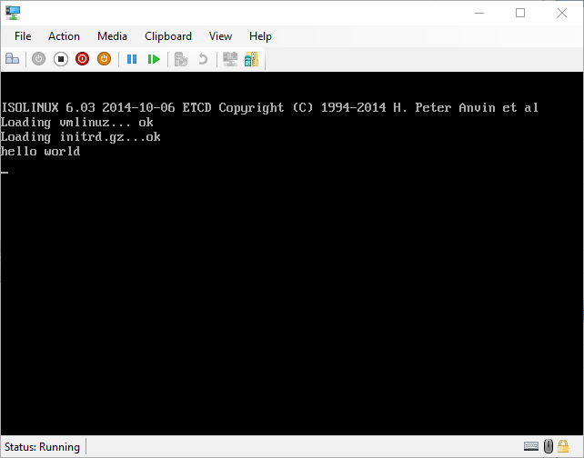

# Linux Hello World

## Purpose
This repository showcases how to create a minimal bootable linux iso. 

## Requirements
  - bash
  - gcc
  - flex
  - bison
  - mkisofs
  - nix utilities:
     - find
     - gzip
     - strip
     - cpio
     - make
     - coreutils (mkdir, cp)
     - wget

## Running
Run `mkiso.sh` with bash
```
bash mkiso.sh
```
## How it works?
### kernel
  Kernel is built with minimal possible config.\
  Relevant settings:
  | setting name   | setting prompt                          | comment                                       |
  | -------------- | --------------------------------------- | --------------------------------------------- |
  | BLK_DEV_INITRD | initramfs/initrd support                | we are using initrd to store init executable  |
  | RD_GZIP        | initramfs/initrd compression using gzip | initrd is compressed to further decrease size |
  | BINFMT_ELF     | kernel support for elf binaries         | init executable is in this format             |

### init
  init is the first process that is forked after succesfully bootstrapping the kernel. The only purpose of our init is to write `hello world` message to standard output.
### initrd
TODO
### building iso
TODO

## Result

